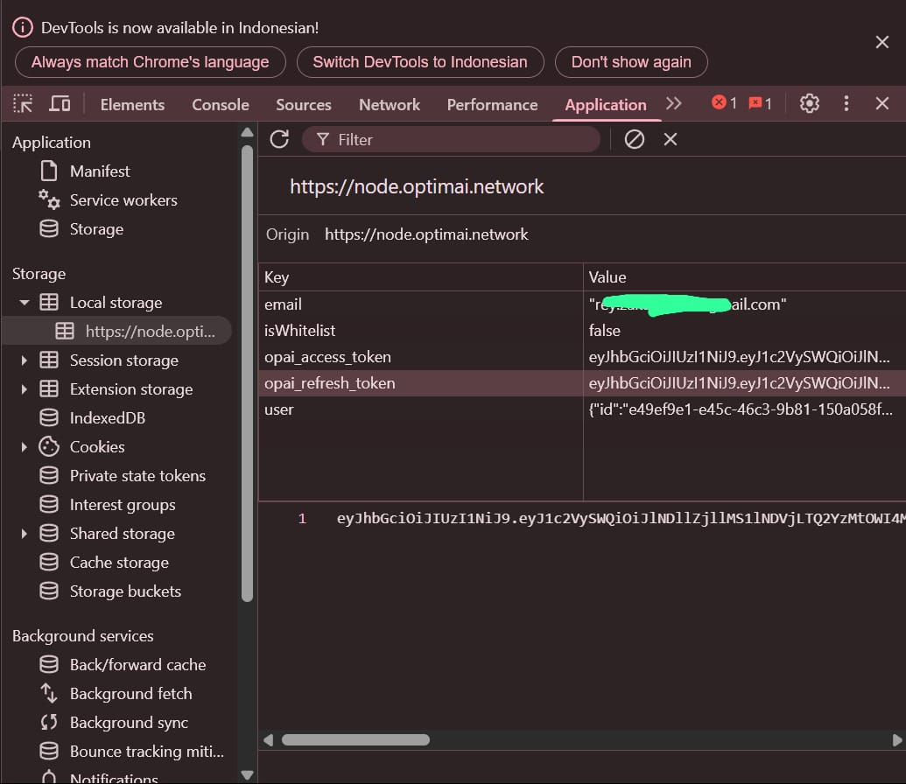
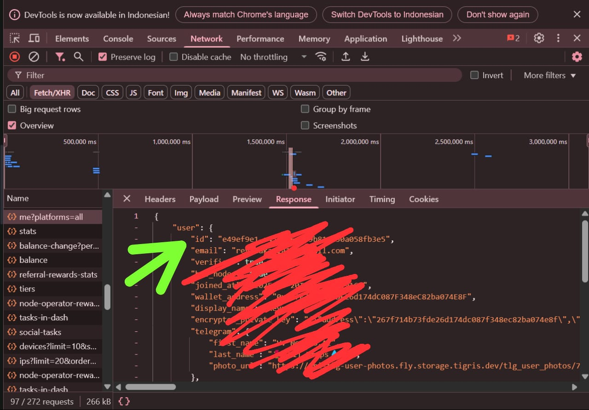
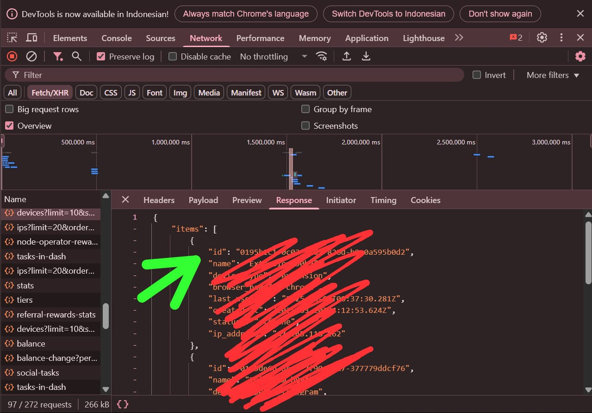
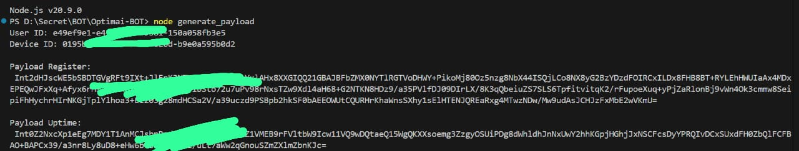

# OptimAi Extension BOT

- Register Here : [OptimAi Dashboard](https://node.optimai.network/register?ref=F87B5BA4)

## Features

  - Auto Get Account Information
  - Auto Run With [Monosans](https://raw.githubusercontent.com/monosans/proxy-list/main/proxies/all.txt) Proxy - Choose 1
  - Auto Run With Private Proxy - Choose 2
  - Auto Run Without Proxy - Choose 3
  - Auto Claim Daily Check-In
  - Auto Register Nodes & Update The Uptime
  - Multi Accounts With Threads

## Requiremnets

- Make sure you have Python3.9 or higher installed and pip.
- Node.js.

## Instalation

1. **Clone The Repositories:**
   ```bash
   git clone https://github.com/DropsterMind/OptimAi-AUTO.git
   ```
   ```bash
   cd OptimAi-AUTO
   ```

2. **Install Requirements:**
   ```bash
   pip install -r requirements.txt #or pip3 install -r requirements.txt
   ```

## Configuration

- **accounts.json:** You will find the file `accounts.json` inside the project directory. Make sure `accounts.json` contains data that matches the format expected by the script. Here are examples of file formats:
  ```bash
  [
      {
          "refreshToken": "your_opai_refresh_token_1",
          "registerPayload": "your_register_payload_1",
          "uptimePayload": "your_uptime_payload_1"
      },
      {
          "refreshToken": "your_opai_refresh_token_2",
          "registerPayload": "your_register_payload_2",
          "uptimePayload": "your_uptime_payload_2"
      }
  ]
  ```

- **proxy.txt:** You will find the file `proxy.txt` inside the project directory. Make sure `proxy.txt` contains data that matches the format expected by the script. Here are examples of file formats:
  ```bash
  ip:port # Default Protcol HTTP.
  protocol://ip:port
  protocol://user:pass@ip:port
  ```

### How to Get Register & Uptime Payload

1. Run the javascript file
   ```javascript
   node generate_payload.js
   ```
2. Enter Your User ID & Device ID
3. Copy The Result and Paste on accounts.json

### Screenshoots

<div style="text-align: center;">
  <h4><strong>Opai Refresh Token</strong></h4>
  
</div>

<div style="text-align: center;">
  <h4><strong>User ID</strong></h4>
  
</div>

<div style="text-align: center;">
  <h4><strong>Device ID</strong></h4>
  
</div>

<div style="text-align: center;">
  <h4><strong>Generate Payload</strong></h4>
  
</div>

## Run

```bash
python bot.py #or python3 bot.py
```

## ☕ Buy Me a Coffee
If you find this project helpful, consider supporting me through crypto tips:

- **EVM:** 0x8AD937497B71913167295202d242de4d9FeE3934

- **TON:** UQCTmU0xhlyy077Mdr9R0UAfw529XAVzi76QSYksGzhf6Z6U

- **SOL:** 7WJHZn59gUHtF6bNVQLi5XL37Ni2zvUYA2M7kskkpzu8

- **SUI:** 0xdf86f613edb2c75b325922ff81fc5c13e0aff7a7d788f68611ff82f9a667dc47

🙏 Thanks for checking out this repository!
Don’t forget to star ⭐ and follow if you find it useful.
If you encounter issues, have questions, or want to suggest improvements — feel free to reach out or open an issue right here.

## — DropsterMind 🧠
